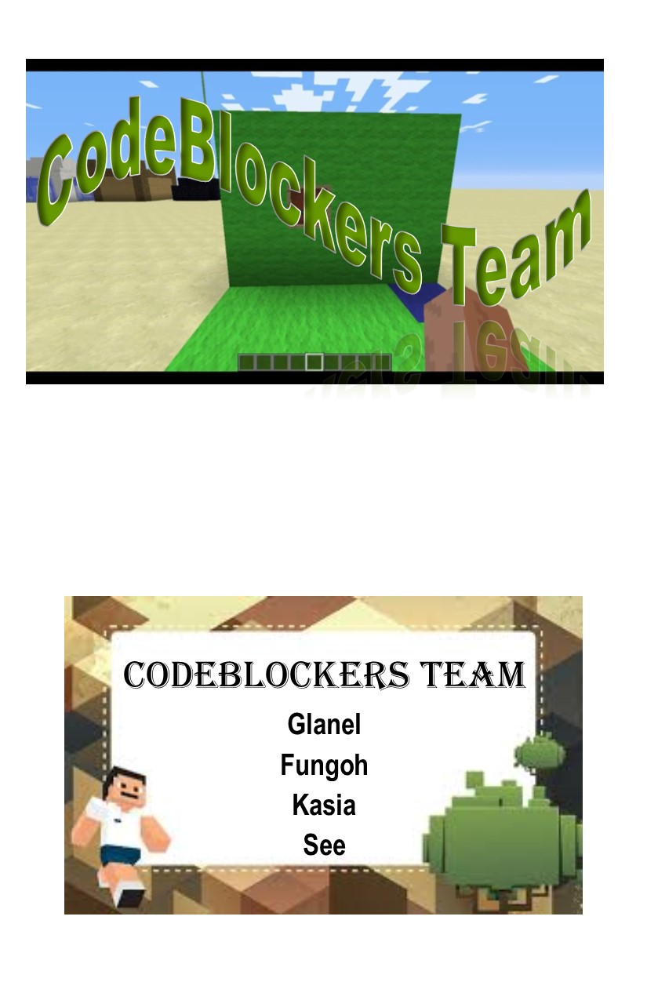
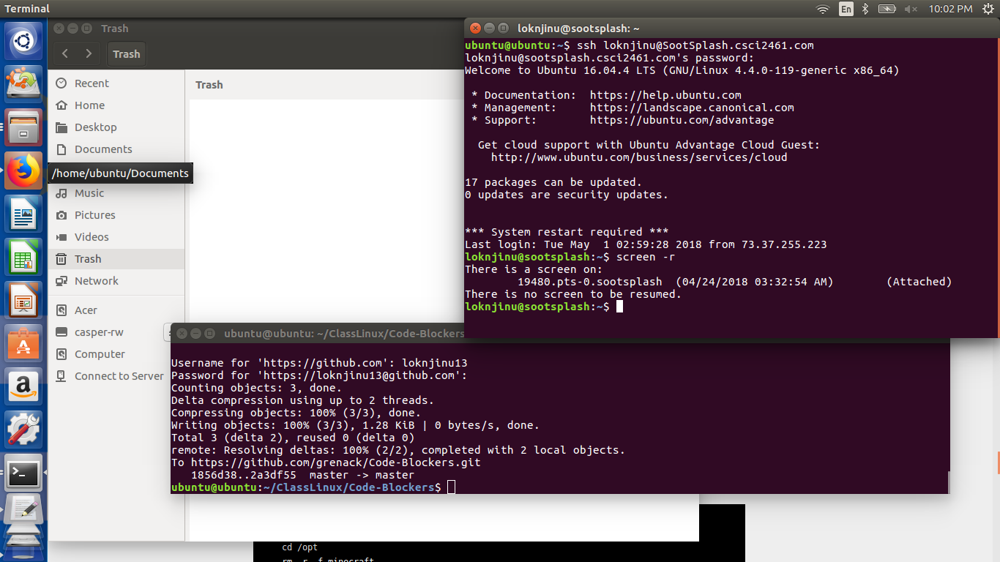
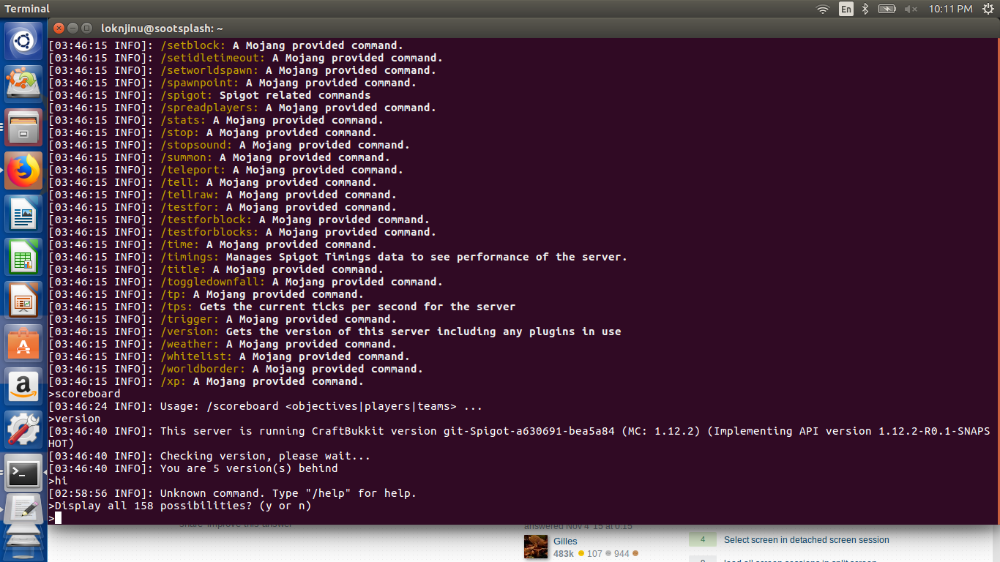
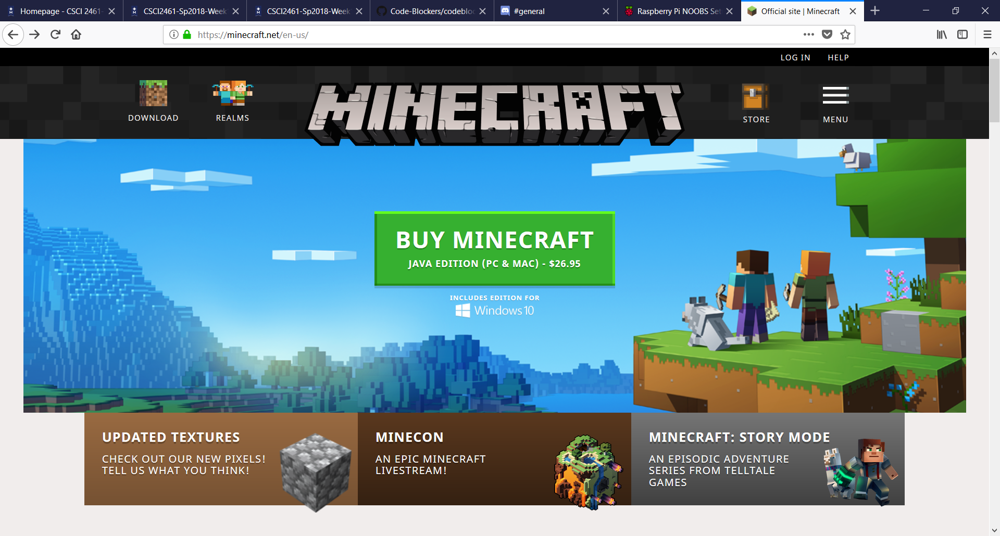
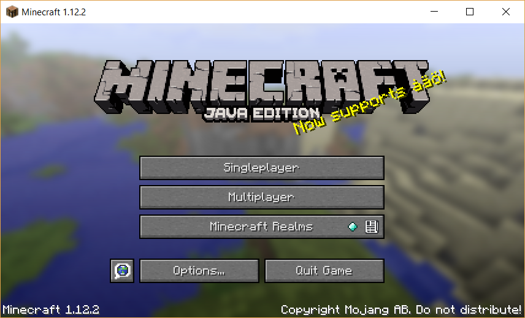
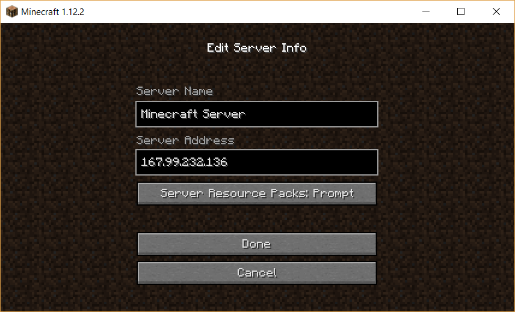
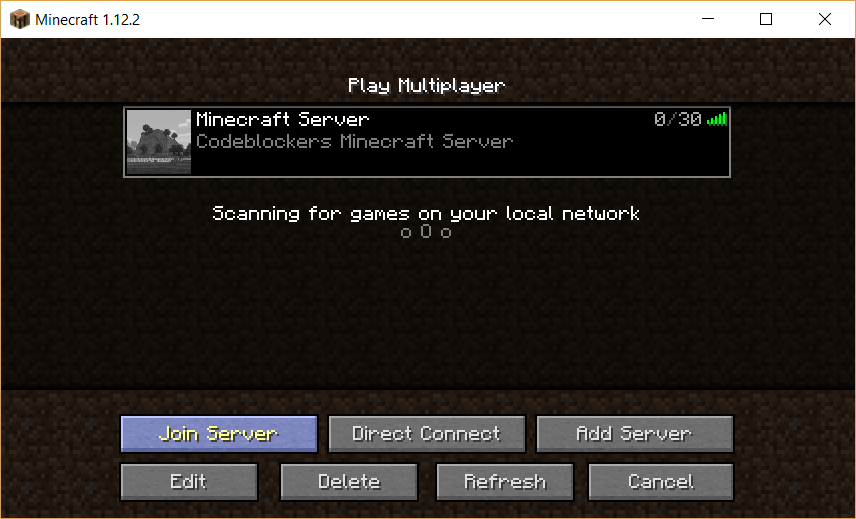
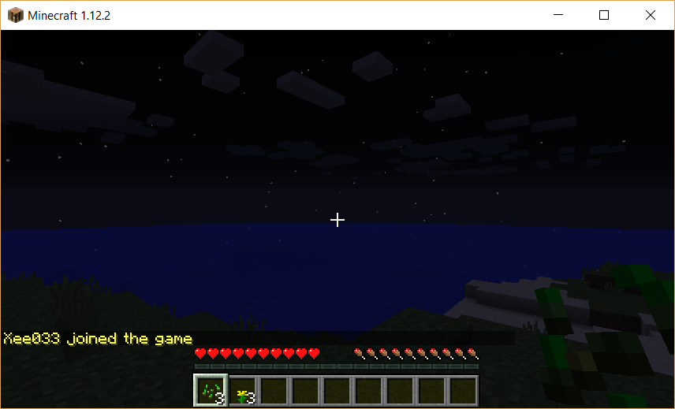
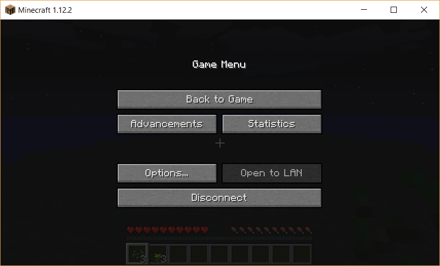
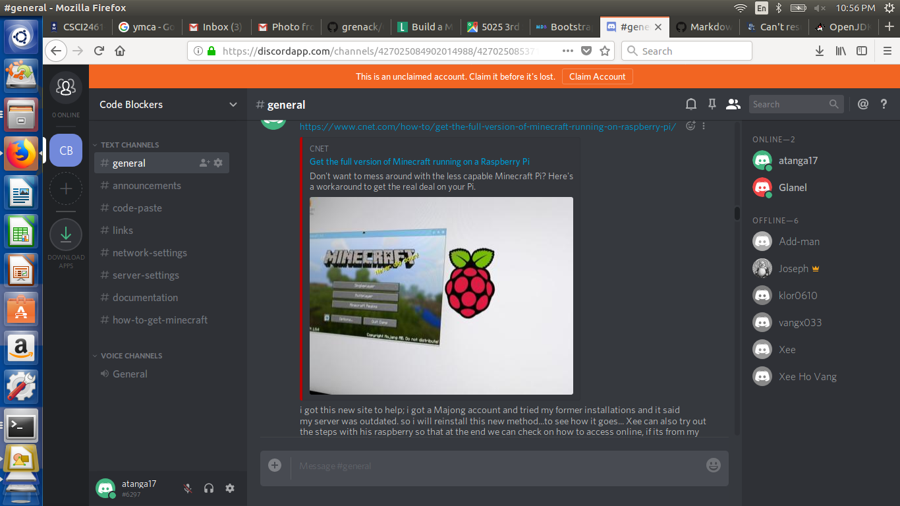

# CSCI2461-71.... 
# FINAL PROJECT; Computer Networking 3-LINUX

# TEAM; CODE BLOCKERS

##### 1. Adam T (Testing) - [Github](https://github.com/Add-man)

##### 2. Fongoh LOKNJINU (Research) - [Github](https://github.com/loknjinu13)

##### 3. Vangx033 (Testing) -[Github](https://github.com/vangx033)

##### 4. Glanel Houenouvi (Documentation) - [Github](https://github.com/grenack)

##### 5. Kasia Lor (Support) - [Github](https://github.com/klor0610)

# Table of contents
1. [Introduction](#Introduction)
2. [Shortcomings](#Shortcomings)
3. [Hardware Platforms](#Hardware)
4. [Protocols & Firewall](#Protocols)
5. [Raspberry Installation](#Rasberry)
6. [SootSplash Installation](#SootSplash)
7. [Difficulties Encountered](#Difficulties)
8. [Screen](#Screen)
9. [Deployment Success](#Deployment)
10. [Updating Server](#Updating)
11. [Recovering Server](#Recovering)
12. [Backing Up Server](#Backing)
13. [How to Play and Access](#PlayMinecraft)
14. [Conclusions](#Conclusions)

## Introduction 
A Minecraft Server is what our group deployed for our final project in the Networking 3 - Linux class.
There are five members in the group and each one has a special role to work with.
Check out our Github accounts to find out more and see the documentation that goes along with our project.

## Shortcomings 
	- Mostly online interactions.
	- Some team members dropped.
	- No prior knowledge of the game by remaining team members.

## Hardware Platforms 
	a. Raspberry Pi 3(Manual steps Installation)
This is Server on Raspbian  on the armv7l platform.
	b. Raspberry Pi 3(Script Assisted Installation)
This Rasbian server was used for testing the scripts to check on errors.
	c. SootSplash Server 
This is a Server built on Ubuntu 16.04.4 LTS (GNU/Linux 4.4.0-119-generic x86_64)

## Protocols & Firewall 
 a. Minecraft is compiled using Java. It will use the Transmission Control Protocol(TCP) of the Internet protocol suite.
This permits the connection between users while playing the game.
The following characteristics describe the TCP;
 + Connection oriented
 + Guaranteed reliable
 + 3-way handshake
 + Connection established between two neighbors
 + A send SYN to B
 + B send SYN ACK to A
 + A send ACK to B

  TCP will use Port 25565 in order to establish connection with users from the server.
 b. SSH : Secure Shell is the protocol used to access any of the servers

 c. Firewall: The server needs to be protected from external access. The following will be added in the iptables.
**`-A INPUT -p tcp -m state --state NEW --dport 25565 -j ACCEPT`**

## Raspberry Installation 

#Installation of a Minecraft Raspberry Server

### Raspberry Pi Model
It is recommended we use Raspberry 3 with its 1Gigabyte of RAM and a quad core ARM cpu.n\This version does not need overclocking configurations.
We can download the OS for installation on your raspberry usb micro sd [here](https://www.raspberrypi.org/downloads/raspbian/). 
Using [etch]()we can make our micro sd card bootable. The Rasbian Stretch version is preferable and you can decide between the Lite or Desktop images.

### Why Raspberry Pi
We will use a raspberry Pi for test purposes and to start a small minecraft server for a lan server.
The tested environment shall be transferable into a dedicated server provided. This dedicated server shall have its server.properties file reconfigured to accomodate the bigger server on a dedicated Linux hardware with Intel/AMD processors. In addition, since Rasbian is a debian distribution, all configurations and instructions would work on Debian servers.
## Login to your Pi
 Via using your console

 Via using ssh: ssh pi@address
### Download Java
Minecraft requires Java to run. We will download the latest Oracle Java.
We will change to the /opt directory, use wget to download and accept Oracle agreements and then extract contents to the opt folder. The following command will help us;
- `cd /opt`
- `sudo wget --no-cookies --no-check-certificate --header "Cookie: gpw_e24=http%3A%2F%2Fwww.oracle.com%2F; oraclelicense=accept-securebackup-cookie" http://download.oracle.com/otn-pub/java/jdk/8u161-b12/2f38c3b165be4555a1fa6e98c45e0808/jdk-8u161-linux-arm32-vfp-hflt.tar.gz`
- `sudo tar -zxvf jdk-8u161-linux-arm32-vfp-hflt.tar.gz`
### Configuration of Java
We will configure the Java environment to permit our our system access the jav$
We will use the following commands;
- `sudo update-alternatives --install /usr/bin/java java /opt/jdk1.8.0_161/bin/java 1`
- `sudo update-alternatives --install /usr/bin/javac javac /opt/jdk1.8.0_161/bin/javac 1`

We will then set this java version as the default versions. Select the right v$
- `sudo update-alternatives --config java`
- `sudo update-alternatives --config javac`

We will then check our java version
- `java -version`
- `javac -version`

### Setting Up Minecraft environment

Lets update and upgrade our system
- `sudo apt-get update && sudo apt-get -y upgrade`
Install git
- `sudo apt-get install git`

Lets install screen to assist us run the minecraft server console while logged out of pi.
- `sudo apt-get install screen`
### Installing Minecraft

We will install the [Spigot Minecraft Server build](https://www.spigotmc.org).
Lets create a folder

`cd /home/pi`

`sudo mkdir ~/codeblockers`

`cd ~/codeblockers`

We will download the buildtools
- `wget https://hub.spigotmc.org/jenkins/job/BuildTools/lastSuccessfulBuild/artifact/target/BuildTools.jar`

Then build our server. This compilation process takes close to an hour on a Pi 3 system.
- `sudo java -jar BuildTools.jar --rev 1.12.2`

### Configuring the Spigot server
Once the compilation is completewe should ensure we are in the codeblockers directory and run the server for the first time.
- `sudo java -Xms512M -Xmx1008M -jar /home/pi/codeblockers/spigot-1.12.2.jar nogui`
We will then accept the EULA agreement after the server stops running.
- `sudo nano eula.txt`

Inside the eula.txt, change the line _eula=false_ to `_eula=true_`

Let us now change the server properties
- `sudo nano server.properties`

The following properties are recommended for a start, but you can change server.properties following its Wiki.

- Minecraft server properties
- spawn-protection=16
- generator-settings=
- force-gamemode=true
- allow-nether=true
- gamemode=0
- enable-query=false
- player-idle-timeout=0
- difficulty=2
- spawn-monsters=true
- op-permission-level=4
- announce-player-achievements=true
- pvp=true
- snooper-enabled=true
- level-type=DEFAULT
- hardcore=false
- enable-command-block=false
- max-players=10
- network-compression-threshold=256
- resource-pack-sha1=
- max-world-size=29999984
- server-port=25565
- debug=false
- server-ip=
- spawn-npcs=true
- allow-flight=false
- level-name=world
- view-distance=10
- resource-pack=
- spawn-animals=true
- white-list=false
- generate-structures=true
- online-mode=true
- max-build-height=256
- level-seed=
- prevent-proxy-connections=false
- use-native-transport=true
- motd=CodebMinecraft Server
- enable-rcon=false

Now lets rerun our server
`sudo java -Xms512M -Xmx1008M -jar /home/pi/codeblockers/spigot-1.12.2.jar nogui`

### Script to Run server
Lets make the minecraft server to run from a script.
 - `mkdir /home/pi/startup`
   - `cd /home/pi/startup`
   - `nano minecraft.sh`
Inside our minecraft.sh, we will add the following scripts.

`#!/bin/bash`

   `cd /home/pi/codeblockers/ && java -Xms512M -Xmx1008M -jar /home/pi/codeblockers/spigot-1.12.2.jar nogui`

We will save the file and make it executable
- `chmod u+x minecraft.sh`
Lets start the server
- `screen`   <---hit enter at the message that appears.
- `sudo /home/pi/startup/minecraft.sh`

To exit the screen session hit _CTRL AD_

### Configure Minecraft to start on bootup
We will edit the /etc/rc.local file
- `sudo nano /etc/rc.local`

Insert the following before the last line _exit 0_
- `screen -dm -S minecraft /home/pi/startup/minecraft.sh`

### After bootup the following can be run
- `sudo screen -r minecraft`

### Creating Backup
This will permit restoring the minecraft server
- `cd ~`
- `tar -zcvf codeblockers_backup.tar.gz ~/codeblockers`

We can now copy this zip file to a safe location or server. Restoration should be done regularly considering we have to entertain others and their achievements. This is this area which needs technical support in great details.

## SootSplash Installation 

###Installation of a Minecraft Server on Ubuntu

### Ubuntu Server
This will be installed on sootsplash.csci2461.com, a server hosted by Digital Ocean.

###Login to your server

 Via using ssh: ssh `useraccount`@sootsplash.csci2461.com
 
### Download Java
Minecraft requires Java to run. We will download the latest Oracle Java.
We will change to the /opt directory, use wget to download and accept Oracle agreements and then extract contents to the opt folder. The following command will help us;
- `cd /opt`
- `wget --no-cookies --no-check-certificate --header "Cookie: gpw_e24=http%3A%2F%2Fwww.oracle.com%2F; oraclelicense=accept-securebackup-cookie" http://download.oracle.com/otn-pub/java/jdk/8u161-b12/2f38c3b165be4555a1fa6e98c45e0808/jdk-8u161-linux-x64.tar.gz`
- `tar -zxvf jdk-8u161-linux-x64.tar.gz`
### Configuration of Java
We will configure the Java environment to permit our our system access the java binary and compiler necessary in building our minecraft server.
We will use the following commands;
- `sudo update-alternatives --install /usr/bin/java java /opt/jdk1.8.0_161/bin/java 1`
- `sudo update-alternatives --install /usr/bin/javac javac /opt/jdk1.8.0_161/bin/javac 1`

We will then set this java version as the default versions. Select the right version option.
- `sudo update-alternatives --config java`
- `sudo update-alternatives --config javac`

We will then check our java version
- `java -version`
- `javac -version`

### Setting Up Minecraft environment

Lets update and upgrade our system
- `sudo apt-get update && sudo apt-get -y upgrade`
Install git
- `sudo apt-get install git`

Lets install screen to assist us run the minecraft server console while logged out of pi.
- `sudo apt-get install screen`

### Installing Minecraft

We will install the [Spigot Minecraft Server build](https://www.spigotmc.org).
Lets create a folder

`cd /opt`

`sudo mkdir minecraft`

`cd minecraft`

We will download the buildtools
- `wget https://hub.spigotmc.org/jenkins/job/BuildTools/lastSuccessfulBuild/artifact/target/BuildTools.jar`

Then build our server. This compilation process takes close to 45 minutes on this server.
- `sudo java -jar BuildTools.jar --rev 1.12.2`

### Configuring the Spigot server
Once the compilation is completewe should ensure we are in the minecraft directory and run the server for the first time.
- `sudo java -Xms1024M -Xmx2048M -jar /opt/minecraft/spigot-1.12.2.jar nogui`

Xms1024M and Xms2048M are parameters telling java to start with 1GB of ram as a minimum for the spigot jar file and grow to 2GB maximum.
We will then accept the EULA agreement after the server stops running.
- `sudo nano eula.txt`

Inside the eula.txt, change the line _eula=false_ to `_eula=true_`

Let us now change the server properties
- `sudo nano server.properties`

The following properties are recommended for a start, but you can change server.properties following its Wiki.

- Minecraft server properties
- spawn-protection=16
- generator-settings=
- force-gamemode=true
- allow-nether=true
- gamemode=0
- enable-query=false
- player-idle-timeout=0
- difficulty=2
- spawn-monsters=true
- op-permission-level=4
- announce-player-achievements=true
- pvp=true
- snooper-enabled=true
- level-type=DEFAULT
- hardcore=false
- enable-command-block=false
- max-players=30
- network-compression-threshold=256
- resource-pack-sha1=
- max-world-size=29999984
- server-port=25565
- debug=false
- server-ip=
- spawn-npcs=true
- allow-flight=false
- level-name=world
- view-distance=10
- resource-pack=
- spawn-animals=true
- white-list=false
- generate-structures=true
- online-mode=true
- max-build-height=256
- level-seed=
- prevent-proxy-connections=false
- use-native-transport=true
- motd=CodebMinecraft Server
- enable-rcon=false

Now lets rerun our server
`sudo java -Xms1024M -Xmx2048M -jar /opt/minecraft/spigot-1.12.2.jar nogui`

`stop` to stop the server and complete the remaining phase of the installation.

### Script to Run server
Lets make the minecraft server to run from a script.
 - `cd /opt && sudo mkdir scripts`
   - `cd scripts`
   - `nano minecraft.sh`
Inside our minecraft.sh, we will add the following scripts.

`#!/bin/bash`

   ` cd /opt/minecraft/ && sudo java -Xms1024M -Xmx2048M -jar /opt/minecraft/spigot-1.12.2.jar nogui`

We will save the file and make it executable
- `chmod u+x minecraft.sh`
Lets start the server
- `screen`   <---hit enter at the message that appears.
- `sudo /opt/scripts/minecraft.sh`

To exit the screen session hit _CTRL AD_

### Configure Minecraft to start on bootup
We will edit the /etc/rc.local file
- `sudo nano /etc/rc.local`

Insert the following before the last line _exit 0_
- `screen -dm -S minecraft /opt/scripts/minecraft.sh`

### After bootup the following can be run
- `sudo screen -r minecraft`

### Creating Backup
This will permit restoring the minecraft server
- `cd /opt`
- `tar -zcvf minecraft_backup.tar.gz minecraft`

We can now copy this zip file to a safe location or server. Restoration should be done regularly considering we have to entertain others and their achievements. This is the area which needs technical support in great details.

## Difficulties Encountered 

When we issued the java build command we encountered this error when the script ran;

_/usr/bin/java: 1: /usr/bin/java: Syntax error: word unexpected (expecting ")")_

**To solve the above we used the open jdk environment as our installation was based on Oracle Java**
To install open jdk the following commands should be used;

`sudo add-apt-repository ppa:openjdk-r/ppa`  
`sudo apt-get update`   
`sudo apt-get install openjdk-8-jdk`

This defines the “PPA for OpenJDK uploads (restricted)” as an additional package repositiory, updates your information, and installs the package with its dependencies (from that repository). 
It should be noted that each time you write a command which has to alter system files **_sudo_** must be used as this is a secured server. This is different from your local server.

 When we ran our server it could not bind to port 25565 as another instance was running
so we did the following;

_`sudo lsof -n -i`_

To kill the process and finally make the server start.
_`sudo fuser -k 25565/tcp`_

This helped me to restart the server. But during class discussions, we noticed we had to work with firewalls.
The _iptables_ proofed that the tcp port 25565 was not listed and had to be added  by administrative rights.

We applied this rule;
 _`sudo /sbin/iptables -A INPUT -p tcp --dport 25565 -m state --state NEW -j ACCEPT`_

While in class the following command was utilised.

`sudo iptables -A INPUT -p tcp --dport 25565 -m state --state NEW -j ACCEPT`

The current issue we face is the fact that once there is a broken pipe, our server cannot restart. This we figured out.
We decided to use `sudo` to lanch the script. It is worth noting that Sootpslash Server has many services and security protocols. This therefore means, access to certain files  by a session will not obtain total read and write permissions.
Consquently, launching the server as the adminstrator assures the server to give permissions on file changes while the game is on.  

 Likewise we changed the /rc.local to launch the minecraft server from startup if the main server reboots. We have not tested this yet!!
We also made installation scripts for [Raspberry](https://github.com/loknjinu13/week14/blob/master/codeblockers.sh) and [Linux](https://github.com/loknjinu13/week14/blob/master/codeblockers1.sh) platforms as there is a hardware difference. 

It should be noted that, it is preferrable to run the script manually rather than automatically if the user does not have full control over the server session.

## Screen 

#### How we used Screen in our Minecraft Server.
Screen is a full-screen window manager that multiplexes a physical terminal between several processes, typically interactive shells.
When a program terminates, _screen_ kills the window that contained it. 

**TMUX** is another full-screen window manager with capabilities like _screen_ and is developed to outperform screen with more funstions.
These softwares permit us to continue from wherever we stopped in our terminals.
We installed screen to assist us control our Minecraft Server from its terminal. 
This is why we include screen in the automatic script to run the server once Ubuntu server boots. This permits the Administrator to run the server session.
The following command in our _codebminecraft.sh script_ explains it better;
When editing the rc.local file

`sudo nano /etc/rc.local`
add the following into the line before exit 0...

 `screen -dm -S minecraft /opt/scripts/codebminecraft.sh`

Whenever the server is running and you closed the terminal before and will want to check the server,
just run the following command in your session;
`_screen -r_`

The folowing are different instances of using _screen_.

To list screen terminals;
`screen -ls` or `screen -list`
To resume a screen session use;
`screen -r`
To detach a screen session use;
`screen -d`
You can resume and detach a particular session with this sample command;
`screen -r -d ~~30608~~`
~~30608~~ being the terminal session you want to resume.

## Deployment Success 

It has been an educative ride for our team. Doing research and testing was fun but getting into difficulties was more educative as it opened up more venues for research.
** Launch Server**

|Platform	|Boot Directory		|Boot Command			|
|---------------|-----------------------|-------------------------------|
|Rasbian	|cd Startup		|sudo ./minecraft.sh		|
|Ubuntu Server	|cd /opt/scripts	|sudo ./codebminecraft.sh	|

It is essential you create automatic backups. Ensure the location is able to store such backups.
Lets use our installed server as an example. In order to play on this Minecraft server, everyone will need a Mojang account to LOGIN. To obtain an account click [Here](https://minecraft.net/en-us/store/minecraft/#register). Now you have an account... You need the _Minecraft Client_ software to access!!! In your Mojang account, there are links to download for Windows, Linux and MAC users. Choose the client software that matches up with your Operating System.

Once your Client software is launched, Choose **Multiplayer**.
This will lead you to insert the name of the server preferably **Code_B_Minecraft**. 
The server address will be _`167.99.232.136`_.
 **Join The Server** and I will be on alert to Welcome you OnBoard. 
To **_chat_** while in the server, just type **T** on your keyboard.

That's it!

These are pictures of our installation and servers functioning:

Active Servers:

Pi Server:

Pi Server:

Pi Server:

SootSplash Server:

SootSplash Server:

SootSplash Server:

Both Servers:

## Updating Server 

Mojang releases new versions of minecraft server. It is necessary to upgrade the server when necessary.
The following process ;
Login to the server and stop the minecraft server. In the minecraft console type `stop` and hit _enter_.
`cd /opt`
`tar -zcvf minecraft_backup.tar.gz minecraft`
`cd /opt/minecraft`
`wget https://hub.spigotmc.org/jenkins/job/BuildTools/lastSuccessfulBuild/artifact/target/BuildTools.jar -O BuildTools.jar`

Then we rebuild the new  spigot server.
`sudo java -jar Buildtools.jar --rev 1.12.2`

Then update the _minecraft.sh_ startup script to use the latest jar file.
`cd /opt/scripts
`nano minecraft.sh`

Update the command to start the new jar file.
`cd /opt/minecraft/ && java -Xms1024M -Xmx2048M -jar /opt/minecraft/spigot-1.~~12.2~~.jar nogui

Save the file.
Restart the server.

## Recovering Server 

It is important to regularly backup your Minecraft server. At times exception errors occur when you log into your minecraft server.
Or many things disappear from the world. The world may have been corrupted for any number of issues such as software problems or disk errors.

With backups available, restore the previous backup with the following;
Delete the existing minecraft folder you created
`cd /opt`
`sudo rm -r -f minecraft`

Copy the previously saved minecraft.tar.gz file to your /opt folder.
Restore your minecraft world by

`tar -zxvf minecraft.tar.gz`

Restart the server and the minecraft server will be successfully restored.

## Backing Up Server 

To Backup the server, do the following;
login to the server

`cd /opt`

`tar -zcvf minecraft_backup.tar.gz minecraft`

Copy the **minecraft_backup.tar.gz** to a safe location. This file will be used to restore your world when needed.
Do this frequently or use the `cron scheduler` to automate the process at a specified time each day.

## How To Play and Access 

### Here are the steps on how to connect to the Minecraft server, please skip to step #4 if you already have an account.

1) Go to https://minecraft.net/en-us and click 'Buy Minecraft' to purchase the game.

2) Enter your address email, password and DOB to create an account.

3) Choose your Operating System (Windows or MAC) and install the application
4) Launch the application and you should see more options such as Single Player, Multiplayer and ect.

5) Click one that you would like to play and click "Add Server". Enter the name and the IP address of the server you would like to join.

6) Once the server is added, click the server and "Join Server"(Our sootsplash server IP address is 167.99.232.136).

7) Application will load and take you into the game.

8) To exit, please press "ESC' key and click "Disconnect".

### This is how to play
### Here are some simple keys to get you started:

|	|Keyboard Button	| Function	|	
|-------|-----------------------|---------------|
|	|`E`			|Move forward	|
|	| `S`			|Move backward	|
|	| `A`			| Move left	|
|	| `D`			| Move right	|
|	| `Spacebar`		| Jump		|
|	| `Right click` mouse	| Attack	|
|	| `ESC`			| Exit game	|

Please refer to these two URLs if you are new to minecraft;

How to play: http://www.minecraftopia.com/how_to_play_minecraft

Useful keys for the game: https://www.minecraft101.net/g/controls-and-keyboard.html

## Conclusions 
This project has been very great. Our team had its group discussions via text and via discord.

The picture shows all our team, and this shows we lost 2 members but it never slowed us down. 
We have understood that working as a team means supporting each other. Many circumstances arrive in the development phase.
As team contributors we come to understand to bare the weaknesses of others and teach each other in order to push forth the project. No one is indespensable. Time management is our only key to success.
Kasia Lor took over support and permitted us to go over our presentation and check out the minecraft client presentation.
Xee took care of Testing, as he tested the scripts on his Pi and found errors which we identified in our [Difficulties area](#Difficulties) and he also gave a clear cut presentation on how to access the server as well as how to play.
Glanel was in charge of the documentation which permitted us to compile all sections of our project into one main body, as well as corresponding with team members to check on their level of work and time of publishing.
Fongoh took care of research and permitted us to get the minecraft server up and running and managing the server.

Our project only has as limitation, users having to buy access from Mojang in order to play, therefore limiting interested users. We can only conclude that it is possible to host a game server.
Consequently, we can associate with a game programmer in order to compile a server as such and manage it which can yield income from users obtaining access or permitting free access and monetize the game. 
We also realised Minecraft server online can be used as a chat server amongst users as the administrator whitelist users and blocks unidentified users from accessing. This is a medium to communicate privately and of course rules must be made. 
As a security insight, people can chat over minecraft and we should check on how to monitor over its ports for any National security words if we happen one day to be national security experts.  
